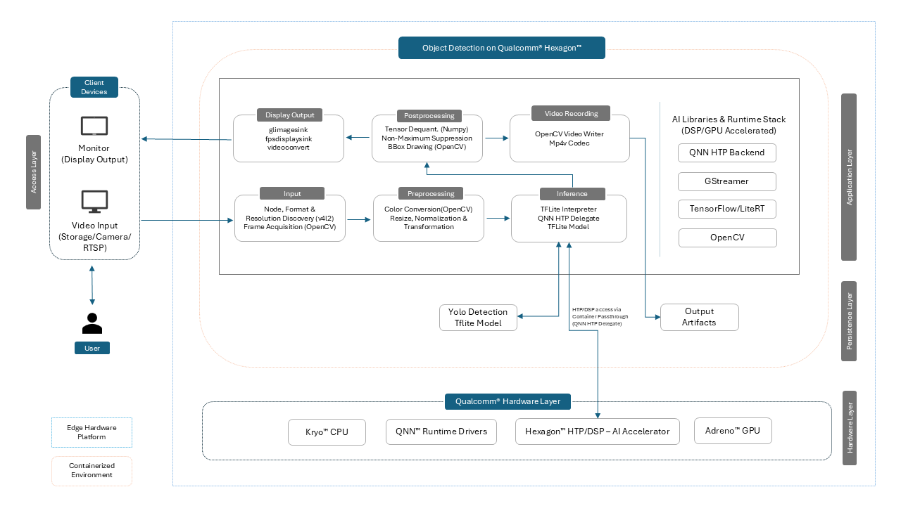

# Object Detection on Qualcomm® Hexagon™

**Version:** 1.0  
**Release Date:** Aug 2025  
**Copyright:** © 2025 Advantech Corporation. All rights reserved.

## Overview

The `Object Detection on Qualcomm® Hexagon™` container image provides a comprehensive environment for Yolov8 object detection model on Qualcomm’s DSP-enabled hardware. This containerized setup ensures full hardware acceleration, reliability, and support for popular runtime environments like QNN, SNPE, and LiteRT.
At the core of this project, **YOLOv8** is used as the object detection model. Two complementary workflows are supported:

1. **Ultralytics Export Workflow**  
   - An automated script directly leverages the **Ultralytics YOLOv8 export utilities**, producing model in TFlite format suitable to run on QCS6490 device utilizing Hexagon™ DSP.
   - Offers flexibility for quick prototyping and validation on the device.  
   - Ideal for iterative development/training where models may frequently change before being finalized.

2. **AI Hub Conversion Workflow**  
   - Models are converted using the Qualcomm® AI Hub toolchain via an automated script
   - This workflow ensures maximum utilization of the Hexagon™ DSP for INT8 inference acceleration.  
   - Best suited for quick deployments where optimized performance is critical.


By combining these two approaches, the project balances rapid prototyping & deployment with Ultralytics and Qualcomm® AI Hub, making it suitable for diverse edge AI applications such as robotics, industrial vision, and smart surveillance etc.


### Key Features

- **Complete AI Framework Stack:** QNN SDK (QNN, SNPE), LiteRT
- **Edge AI Capabilities:** Optimized pipelines for real-time vision tasks (object detection)
- **Preconfigured Environment:** Comes with all necessary tools pre-installed in a container
- **Full DSP/GPU Acceleration:** Utilize Qualcomm® Hexagon™ DSP and Adreno™ GPU for fast and efficient inference
- **Dual YOLOv8 Detection Workflows:** Support for both Qualcomm® AI Hub conversion and Ultralytics export methods, enabling better flexibility


## Quick Demonstration

Detection using Yolov8n Model


## Architecture

Ultralytics Workflow



## Hardware Specifications

| Component       | Specification      |
|-----------------|--------------------|
| Target Hardware | [Advantech AOM-2721](https://www.advantech.com/en/products/a9f9c02c-f4d2-4bb8-9527-51fbd402deea/aom-2721/mod_f2ab9bc8-c96e-4ced-9648-7fce99a0e24a) |
| SoC             | [Qualcomm® QCS6490](https://www.advantech.com/en/products/risc_evaluation_kit/aom-dk2721/mod_0e561ece-295c-4039-a545-68f8ded469a8)   |
| GPU             | Adreno™ 643        |
| DSP             | Hexagon™ 770       |
| Memory          | 8GB LPDDR5         |

## Operating System

This container is intended for **QCOM Robotics Reference Distro with ROS**, version **1.3-ver.1.1** OS running on QCS6490 device.

| Environment        | Operating System                                    |
|--------------------|-----------------------------------------------------|
| **Device Host**    | QCOM Robotics Reference Distro with ROS 1.3-ver.1.1 |
| **Container**      | Ubuntu 22.04 LTS 

## Software Components

| Component   | Version | Description                                                                                  |
|-------------|---------|----------------------------------------------------------------------------------------------|
| LiteRT      | 1.3.0   | Provides QNN TFLite Delegate support for GPU and DSP acceleration                            |
| [SNPE](https://docs.qualcomm.com/bundle/publicresource/topics/80-70014-15B/snpe.html)        | 2.29.0  | Qualcomm’s Snapdragon Neural Processing Engine; optimized runtime for Snapdragon DSP/HTP     |
| [QNN](https://docs.qualcomm.com/bundle/publicresource/topics/80-63442-50/introduction.html)         | 2.29.0  | Qualcomm® Neural Network (QNN) runtime for executing quantized neural networks                |
| GStreamer   | 1.20.7  | Multimedia framework for building flexible audio/video pipelines                             |
| Python   | 3.10.12  | Python runtime for building applications                             |
| OpenCV    | 4.11.0 | Computer vision library for image and video processing |
| **torch** | 1.8.0   | **Used for YOLOv8 model export only** via Ultralytics export utilities                   |
| **torchvision** | 0.9.0  | **Required alongside torch for model export (not used during inference)**                |

## Supported AI Capabilities

### Vision Models

| Model                               | Format       | Note                                                                 |
|-------------------------------------|--------------|----------------------------------------------------------------------|
| YOLOv8 Detection                    | TFLite INT8  | Downloaded from Ultralytics` official source and exported to TFLite using Ultralytics Python packages |
| YOLOv8 Segmentation                 | TFLite INT8  | Downloaded from Ultralytics` official source and exported to TFLite using Ultralytics Python packages |
| YOLOv8 Pose Estimation              | TFLite INT8  | Downloaded from Ultralytics` official source and exported to TFLite using Ultralytics Python packages |
| Lightweight Face Detector           | TFLite INT8  | Converted using Qualcomm® AI Hub                                       |
| FaceMap 3D Morphable Model          | TFLite INT8  | Converted using Qualcomm® AI Hub                                       |
| DeepLabV3+ (MobileNet)              | TFLite INT8  | Converted using Qualcomm® AI Hub                                       |
| DeepLabV3 (ResNet50)                | SNPE DLC TFLite | Converted using Qualcomm® AI Hub                                       |
| HRNet Pose Estimation (INT8)        | TFLite INT8  | Converted using Qualcomm® AI Hub                                       |
| PoseNet (MobileNet V1)              | TFLite       | Converted using Qualcomm® AI Hub                                       |
| MiDaS Depth Estimation              | TFLite INT8  | Converted using Qualcomm® AI Hub                                       |
| MobileNet V2 (Quantized)            | TFLite INT8  | Converted using Qualcomm® AI Hub                                       |
| Inception V3 (SNPE DLC)             | SNPE DLC TFLite | Converted using Qualcomm® AI Hub                                       |
| YAMNet (Audio Classification)       | TFLite       | Converted using Qualcomm® AI Hub                                       |
| YOLO (Quantized)                    | TFLite INT8  | Converted using Qualcomm® AI Hub                                       |


### LLM Models

| Model                               | Format       |   Note                                                         |
|-------------------------------------|--------------|----------------------------------------------------------------|
| Phi2                                | .so          | Converted using Qualcomm's LLM Notebook for Phi-2              |
| Tinyllama                           | .so          | Converted using Qualcomm's LLM Notebook for Tinyllama          |
| Meta Llama 3.2 1B                   | .so          | Converted using Qualcomm's LLM Notebook for Meta Llama 3.2 1B  |

> **Note:** The above tables highlight a subset of commonly used models validated for this environment. Other transformer-based or vision models may also be supported depending on runtime compatibility and hardware resources. For the most detailed and updated list of supported models and runtimes, please refer to the Qualcomm's official [AI Hub](https://aihub.qualcomm.com/models).

## Supported AI Model Formats

| Runtime | Format  | Compatible Versions | 
|---------|---------|---------------------|
| QNN     | .so     |       2.29.0        |
| SNPE    | .dlc    |       2.29.0        |
| LiteRT  | .tflite |       1.3.0         | 

## Hardware Acceleration Support

| Accelerator | Support Level | Compatible Libraries |
|-------------|---------------|----------------------|
| GPU         |  FP32         | QNN, SNPE, LiteRT    |             
| DSP         |  INT8         | QNN, SNPE, LiteRT    |             


### Precision Support

| Precision  | Support Level | Notes |
|------------|---------------|-------|
| FP32       | CPU, GPU      | Baseline precision, highest accuracy  |
| INT8       | CPU, DSP      | Faster inference time, lower accuracy |

## Repository Structure
```
Object-Detection-on-Qualcomm-Hexagon/
├── .env                                      # Environment configuration
├── data                                      # ReadMe Data (images, gifs etc.)
├── windows-git-setup.md                      # Steps to fix LF/CRLF issues on windows while copying to device
├── AI_HUB_EXPORT_README.md                   # Qualcomm® AI Hub based Yolov8 model export guide
├── README.md                                 # Container overview and quick start steps
├── YOLO_EXPORT_README.md                     # Guide for Yolov8 Model export using ultralytics python package
├── build.sh                                  # Script to build the container
├── docker-compose.yml                        # Docker compose file
├── advantech-aihub-model-export.sh           # Automated AI Hub based Yolov8 Detection model conversion script
├── advantech-coe-model-export.sh             # Automated script to convert Yolov8 Detection model via ultralytics package
├── advantech-yolo.py                         # Run Yolov8 Detection inference pipeline
├── video/
│   └── testvideo_720p_25FPS.mp4              # Test MP4 video with 720p resolution & 25 FPS
└── wise-bench.sh                             # Script to verify AI software stack inside the container
```
## Quick Start Guide

### Clone the Repository (on your development machine)

> **Note for Windows Users:**  
> If you are using **Linux**, no changes are needed — LF line endings are used by default.  
> If you are on **Windows**, please follow the steps in [Windows Git Line Ending Setup](./windows-git-setup.md) before cloning to ensure scripts and configuration files work correctly on Device.

```bash
git clone https://github.com/Advantech-EdgeSync-Containers/Nagarro-Container-Project.git
cd Nagarro-Container-Project
```

### Transfer the `Object-Detection-on-Qualcomm-Hexagon` Folder to QCS6490 Board

If you cloned the repo on a **separate development machine**, use `scp` to transfer only the relevant folder:

```bash
# From your development machine (Ubuntu or Windows PowerShell if SCP is installed)
scp -r .\Object-Detection-on-Qualcomm-Hexagon\ <username>@<qcs6490-ip>:/home/<username>/
```

Replace:

* `<username>` – Login username on the QCS6490 board (e.g., `root`)
* `<qcs6490-ip>` – IP address of the QCS6490 board (e.g., `192.168.1.42`)

This will copy the folder to `/home/<username>/Object-Detection-on-Qualcomm-Hexagon/`.

Then SSH into the board:

```bash
ssh <username>@<qcs6490-ip>
cd ~/Object-Detection-on-Qualcomm-Hexagon
```

### Installation

```bash
# Make the build script executable
chmod +x build.sh

# Launch the container
./build.sh
```
### AI Accelerator and Software Stack Verification (Optional)
```bash
# Verify AI Accelerator and Software Stack Inside Docker Container
cd /workspace
chmod +x wise-bench.sh
./wise-bench.sh
```


Wise-bench logs are saved in the `wise-bench.log` file under `/workspace`

### Model Optimization Workflows

For optimal performance, follow these recommended model conversion paths:

#### PyTorch Models

```
PyTorch → ONNX → TensorFlow → LiteRT
```

#### TensorFlow Models
```
TensorFlow → SavedModel → QNN(.cpp, .bin) → QNN Model Library(.so)
```

```
TensorFlow → SavedModel → SNPE(.dlc)
```

```
TensorFlow → LiteRT
```


## Model Export Options

### Option 1 - Ultralytics Export Workflow: 

#### Export YOLOv8 Models via Local Script

Use the export script inside the container to convert and quantize YOLOv8 models to `.tflite`.

[YOLO Export Instructions](./YOLO_EXPORT_README.md)

#### Run YOLO‑Exported Model (CLI)

> **Camera Setup Note:** If you want to run this container for camera feed, ensure the camera is connected to the edge device before running ./build.sh or starting the container. Verify camera detection using the following command:
```bash
v4l2-ctl --list-devices
```

Use the following command to run inference with your exported model:

```bash
python3 advantech-yolo.py --model=<MODEL_PATH> --source=<VIDEO_SOURCE> [--cam-width=<INT>] [--cam-height=<INT>] [--conf-thres=<FLOAT>] [--iou-thres=<FLOAT>] [--save=<OUTPUT_PATH>]
```

Here’s what each field represents:
* **`--model`**
  *Required.* Path to the TFLite YOLOv8 model used for inference (e.g., `model/yolov8n_det.tflite`).

* **`--source`**
  *Optional (default: `/etc/media/video.mp4`).* Can be:

  * A video file path (e.g., `video/testvideo_720p_25FPS.mp4`)
  * A device file for webcam input (e.g., `/dev/video0`)
  * An RTSP video stream (e.g., `rtsp://13.232.142.213:8554/mystream`)

* **`--cam-width`**
  *Optional** (default: `1920`).* Applicable **only when `--source` is a webcam device**. Sets the webcam's capture width.

* **`--cam-height`**
  *Optional** (default: `1080`).* Applicable **only when `--source` is a webcam device**. Sets the webcam's capture height.

* **`--conf-thres`**
  *Optional (default: `0.5`).* Confidence threshold to filter out low-confidence detections (value between 0 and 1).

* **`--iou-thres`**
  *Optional (default: `0.5`).* Intersection-over-Union threshold governing Non-Maximum Suppression, removing overlapping detections.
 
* **`--save`**
  *Optional.* File path to save the annotated inference output as an MP4 video. The footage will still be displayed live via GStreamer.

##### Example Commands

* **Run detection on a video file:**

  ```bash
  python3 advantech-yolo.py --model=model/yolov8n_det.tflite --source=video/testvideo_720p_25FPS.mp4
  ```
* **Run detection via discover (e.g. `discover`):**

  ```bash
  python3 advantech-yolo.py --model=model/yolov8n_det.tflite --source=discover
  ```
* **Run detection via webcam (e.g. `/dev/video0`):**

  ```bash
  python3 advantech-yolo.py --model=model/yolov8n_det.tflite --source=/dev/video0 --cam-width=1920 --cam-height=1080
  ```
* **Display and Save to MP4 File:**
  ```bash
  python3 advantech-yolo.py --model=model/yolov8n_det.tflite --source=video/testvideo_720p_25FPS.mp4 --save=output.mp4
  ```
---

### Option 2 - AI Hub Conversion Workflow: 

#### Export YOLOv8n from Qualcomm® AI Hub

For pulling models from Qualcomm’s cloud-based hub using an API token.

[AI Hub Export Instructions](./AI_HUB_EXPORT_README.md)

#### Run AI Hub–Exported Model (GStreamer Application)

Customize the AI detection application by editing the configuration file at `/etc/configs/config_detection.json`. This file defines the model, labels, runtime, and other essential settings.

---
##### Configure the Detection Application

You must edit the configuration file located at `/etc/configs/config_detection.json`. Here’s how to do it using `vi`, the standard command-line editor:

**1. Open the file in `vi`:**

```sh
vi /etc/configs/config_detection.json
```

If the file does not exist, `vi` will create one for you.

**2. Basic `vi` usage:**

* You start in **command mode**. To enter **insert mode**, press `i`.
* After editing, press `Esc` to go back to command mode.

**3. Save and exit:**

* Save and quit: Type `:wq` and press Enter
* Or simply `ZZ` (both uppercase)
* Exit without saving: Type `:q!` and press Enter

**4. Vi quick reference:**

| Command | Action                        |
| ------- | ----------------------------- |
| `i`     | Enter insert mode (type text) |
| `Esc`   | Return to command mode        |
| `:wq`   | Save and exit `vi`            |
| `ZZ`    | Save and exit (alternate)     |
| `:q!`   | Exit without saving           |

---

##### General Configuration Template

```bash
{
  "file-path": "<input video path>",
  "ml-framework": "<snpe, tflite, or qnn>",
  "yolo-model-type": "<yolov8, yolonas, or yolov5>",
  "model": "<Model Path>",
  "labels": "<Label Path>",
  "constants": "<Model Constants for LiteRT Model>",
  "threshold": <Post‑processing threshold, integer from 1–100>,
  "runtime": "<dsp, cpu, or gpu>"
}
```

Here’s what each field represents:

* Use **either `file-path`** (for video input) **or `camera`** (for live camera stream), not both.
	* `"file-path"`: Source of input video, e.g., `/etc/media/video.mp4`.
	* `"camera": 0` → Primary camera
	* `"camera": 1` → Secondary camera
* `ml-framework`: Runtime framework—choose one of `snpe`, `tflite`, or `qnn`.
* `yolo-model-type`: Detection model family (e.g., `yolov8`).
* `model`: Full path to the `.tflite` or `.dlc` model.
* `labels`: Label file path mapping detection classes.
* `constants`: Quantization metadata in the format:

  ```
  YOLOv8,q-offsets=<21.0, 0.0, 0.0>,q-scales=<3.05,0.0038,1.0>;
  ```

  Derived from your model’s quantization parameters.
* `threshold`: Confidence cutoff for detections.
* `runtime`: Preferred inference engine—`dsp` (recommended for edge), `cpu`, or `gpu`.

---

##### Example Configuration

```json
{
  "file-path": "/etc/media/video.mp4",
  "ml-framework": "tflite",
  "yolo-model-type": "yolov8",
  "model": "/etc/models/yolov8_det.tflite",
  "labels": "/etc/labels/yolov8.labels",
  "constants": "YOLOv8,q-offsets=<21.0, 0.0, 0.0>,q-scales=<3.0546178817749023, 0.003793874057009816, 1.0>;",
  "threshold": 40,
  "runtime": "dsp"
}
```

This configuration:

* Uses a TFLite-format YOLOv8 model running on the DSP.
* Sets detection threshold to 40%.
* Points to local paths for media, model, and labels.

---

##### Execute the Detection Application

After saving your changes:

```bash
gst-ai-object-detection --config-file=/etc/configs/config_detection.json
```

You'll see the input video annotated in real time—displayed with bounding boxes around detected objects, based on your configuration.

---

#### Important Note: Format & Resolution Support

* This GStreamer-based detection workflow **only supports MP4 and MOV input formats** and is reliably tested at **1080p resolution (1920×1080)**. Using lower resolutions (e.g., 720p or below) may result in misaligned detection boxes due to scaling and aspect ratio handling issues with the video sink.
* In the camera mode, **gst-ai-object-detection** relies on the **qtiqmmfsrc** GStreamer plugin, which is designed to interface with **MIPI‑CSI** connected cameras only. USB webcams are not supported. [Qualcomm® Camera Overview](https://docs.qualcomm.com/bundle/publicresource/topics/80-70020-17/camera-overview.html?vproduct=1601111740013072&version=1.5&facet=Camera)

## Known Limitations

* **LiteRT Runtime:** Limited DSP acceleration support for complex operators.
* **Model Batch Size:** Fixed batch size is required for models targeting DSP acceleration.
* **GStreamer Debug Level:**
   Using `GST_DEBUG=2` or higher may cause the video output to appear in **random positions on screen** or behave unexpectedly.
   Use `GST_DEBUG=0` or `GST_DEBUG=1` for stable video playback.
* **Resolution-Dependent Alignment Issues**: Option 2 is optimized for resolutions at or above **1080p**. **Below 1080p**, detection boxes may appear **misaligned** with objects due to scaling artifacts and coordinate rounding.


---

## Not Included in This Repository

| Component                        | Reason / Note                                    |
| -------------------------------- | ------------------------------------------------ |
| Pre-exported YOLO models         | Must be exported manually using provided scripts |
| Qualcomm® AI Hub API Token        | User must create account and retrieve token      |
| Full training datasets           | Outside scope of this deployment repo            |

---

## Best Practices

* Prefer **INT8 quantized** models for DSP acceleration
* Ensure **fixed batch sizes** when converting models
* Use lower `GST_DEBUG` levels for stable multimedia handling
* Always validate exported models on-device after deployment

## Possible Use Cases

### 1. Industrial Automation
- Detect defective products on assembly lines in real time.
- Monitor safety zones to ensure operators stay clear of robotic arms.
- Track movement of tools or machinery parts for predictive maintenance.

### 2. Smart Retail
- Customer behavior analytics (counting foot traffic, dwell time).
- Shelf monitoring for stock-out detection and planogram compliance.
- Automated checkout by detecting products without barcodes.

### 3. Intelligent Transportation
- Real-time vehicle and pedestrian detection at intersections.
- License plate localization for traffic management.
- Monitoring driver behavior and detecting distractions in cabins.

### 4. Robotics and Drones
- Object detection for autonomous navigation in warehouses or factories.
- Detecting obstacles, pallets, or delivery packages.
- Drone-based inspection of infrastructure (solar panels, power lines, bridges).

### 5. Smart City and Surveillance
- Crowd density estimation and anomaly detection in public spaces.
- Vehicle detection for parking management.
- Perimeter surveillance with alerts for unauthorized entry.

### 6. Healthcare and Assistive Systems
- Detecting PPE compliance (masks, gloves, helmets).
- Monitoring patient activity in elderly care environments.
- Assisting visually impaired individuals by identifying nearby objects.

### 7. Agriculture
- Crop and livestock monitoring through aerial imaging.
- Detecting weeds, pests, or diseases in fields.
- Counting harvested produce in real time for yield estimation.

### 8. Edge AI Research & Development
- Benchmarking new models on Qualcomm® DSP/GPU accelerators.
- Evaluating trade-offs between INT8 and FP32 inference on real workloads.
- Building custom datasets and retraining YOLOv8 for domain-specific applications.


## Acknowledgments

- **[Ultralytics](https://github.com/ultralytics/ultralytics)**: For the YOLOv8 framework that powers this toolkit. 
  ```bash
  # Required specific versions:
  python3 -m pip install ultralytics==8.3.176 --no-deps
  python3 -m pip install ultralytics-thop==2.0.0 --no-deps
  ```
  
© 2025 Advantech Corporation. All rights reserved.